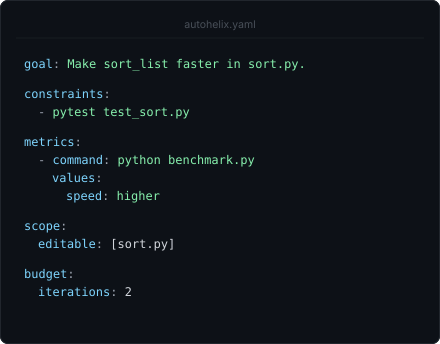
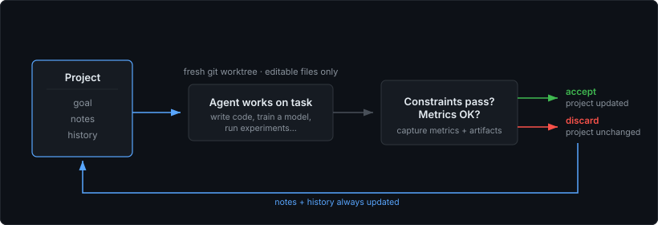
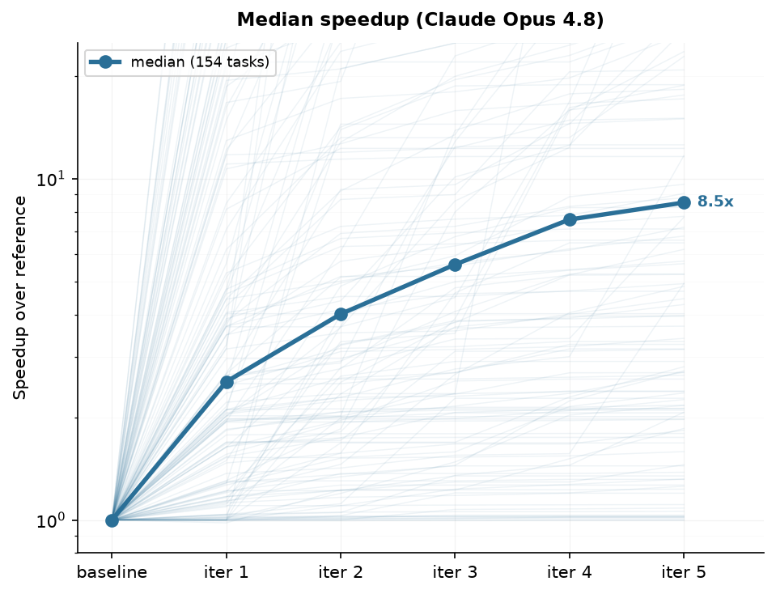
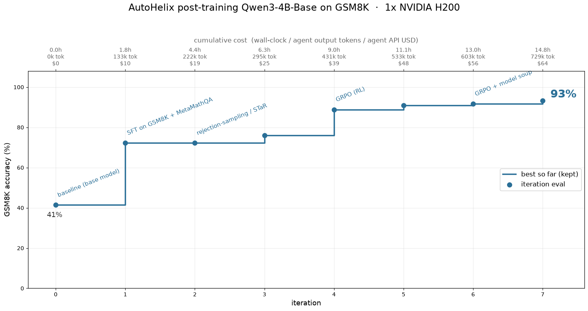
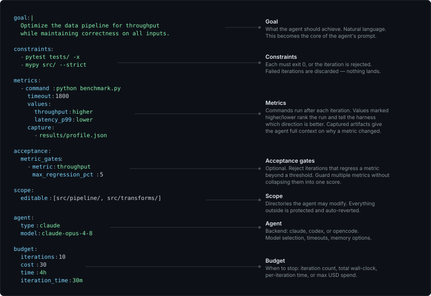

<p align="center">
  <picture>
    <source media="(prefers-color-scheme: dark)"  srcset="assets/autohelix-dark.svg">
    <source media="(prefers-color-scheme: light)" srcset="assets/autohelix-light.svg">
    
  </picture>
</p>

<p align="center"><b>Put an AI agent in a verified improvement loop.</b></p>

<p align="center">
  Set <b>constraints</b> and <b>metrics</b>; the agent proposes changes in a loop. <br>
  Only changes that pass checks get merged. Improvements compound across iterations.
</p>

<p align="center">
  works with <b>Claude Code · Codex · OpenCode</b>
</p>

<p align="center">
  
  
</p>

<p align="center">
  <a href="#how-it-works">How it works</a> ·
  <a href="#quick-start">Quick start</a> ·
  <a href="#examples">Examples</a> ·
  <a href="#configuration">Configuration</a> ·
  <a href="#other-features">Other features</a> ·
  <a href="#faq">FAQ</a>
</p>

<!-- ───────────────────────── DEMO ───────────────────────── -->
<table align="center"><tr>
<td></td>
<td></td>
</tr></table>

---

AutoHelix is a lightweight harness that lets you point an agent at a goal and leave it
looping unattended. It provides the isolation, validation, scope, and budget control to
make that safe, and it's general enough for any measurable goal, from optimizing
code to training models.

Looping an agent can be far more effective than a single prompt, because later iterations
fix and build on what came before, and because it gives you a knob for controlling how much
effort (time or cost) to put toward the goal rather than letting the agent decide when it's
done. AutoHelix makes this pattern easy to run and customize, so you can let the agent
climb for as long as you want.

## How it works

<p align="center">
  
</p>

You define a **goal**, the **constraints** that must hold, and the **metrics**
to track. The agent proposes changes and the harness decides if they land.

Core features:

- **Isolation.** Each iteration runs in a fresh git worktree. A rejected attempt's code is cleanly discarded.
- **Scope enforcement.** Only files marked `editable` can be changed; everything else is frozen.
- **Constraints gate changes.** Tests, type-checks, or any command that must exit 0. Break a constraint and the iteration is discarded.
- **Metrics track progress.** Metrics are captured and shown to the next iteration. Optionally gate on them to reject regressions. Logs and artifacts can be saved too.
- **Persistent memory.** Each iteration is a fresh session, but the agent reads and writes notes that survive across all iterations, including rejected ones.
- **Budget control.** Cap the run by iterations, time, or cost.

## Quick start

Install from source:

```bash
git clone https://github.com/awslabs/AutoHelix.git
cd AutoHelix
python -m venv .venv && source .venv/bin/activate
pip install -e .
```

Or `pip install autohelix` for just the CLI, without the bundled examples.

AutoHelix uses Claude Code by default (looks for `claude` on your `PATH`). Codex and
OpenCode are also supported — see [agent setup](docs/getting-started.md#agent-setup).

```bash
cd my-project
autohelix init          # initialize config and state
autohelix run           # start the loop
```

`init` creates a commented `autohelix.yaml` to fill in — see the configuration section
below. Other commands are described in the [CLI reference](docs/cli.md).

## Examples

The [`examples/`](examples/) directory has ready-to-run tasks across different domains, from
a 2-minute [sorting function](examples/sorting/) example to algorithm optimization and model training. To list what's available:

```bash
python examples/setup_example.py --list
```

**Code optimization.** [AlgoTune](https://github.com/oripress/AlgoTune) is a benchmark for optimizing widely used
algorithms in math, physics, and CS. AutoHelix can scaffold any of them via
[`examples/algotune`](examples/algotune) (we measure speedup with our own eval setup, not identical
to AlgoTune's official harness). The plot below shows a run with Claude Opus 4.8: across 154 tasks,
the median speedup climbs each iteration, reaching ~8.5× by iteration 5.

<table align="center"><tr>
<td></td>
</tr></table>

**Model training.** The same loop works when each iteration is a training run rather than a
code edit: the agent writes the training code and trains a model, and AutoHelix scores the
result with a frozen eval the agent can't modify. In
**[`examples/posttrain`](examples/posttrain)**
(inspired by [PostTrainBench](https://posttrainbench.com/)), the agent is asked to post-train
`Qwen3-4B-Base` on GSM8K. Given an open-ended goal (no method prescribed), the agent
worked its way up from supervised fine-tuning through rejection sampling to reinforcement
learning (GRPO) — reaching **93%** accuracy over 8 iterations on one H200. See the
**[ML Experiments Guide](docs/ml-experiments.md)** for setup tips.

<p align="center">
  
</p>

**In the wild.** Beyond the bundled examples, we've used AutoHelix on real projects. In
[Hybrid Model Factory](https://github.com/awslabs/hybrid-model-factory) — an open-source
toolkit for training hybrid architectures (Attention + SSMs) from our team — the agent
autonomously developed a faster sequence-parallelism implementation. Over multiple runs
(with some algorithmic hints in the goal), it arrived at a state-passing approach that
propagates recurrent state between GPUs instead of redistributing the full sequence,
reaching **~5× faster per layer** and **1.6× faster end-to-end training** at 128K
sequence length on a 27B model.

<!-- ───────────────────── CONFIGURATION ───────────────────── -->

## Configuration

A run is defined by a single `autohelix.yaml`. Every field is documented in
[docs/config.md](docs/config.md).

<p align="center">
  
</p>

**Project layout**

```
my-project/
├── autohelix.yaml       # your config
└── .autohelix/          # runtime state (gitignored)
    ├── prompt.md        # the prompt the agent gets each iteration (editable)
    ├── history.jsonl    # per-iteration results
    ├── notes/           # agent's persistent notes (the only agent-owned state)
    ├── observations/    # per-iteration captured metrics output and artifacts
    ├── reviews/         # reviewer feedback per iteration (if a reviewer is set)
    ├── hints.md         # messages from `autohelix hint`
    ├── logs/            # per-iteration prompts and agent output
    ├── output/          # dashboard.html and reports
    └── worktrees/       # temp iteration dirs (recreated each time)
```

<!-- ───────────────────── OTHER FEATURES ───────────────────── -->

## Other features

<details>
<summary><b>Report</b></summary>

`autohelix report` runs a one-shot agent over the run's history, notes, and git log and
writes a summary to `.autohelix/output/report.md`. See [CLI → report](docs/cli.md#autohelix-report).

</details>

<details>
<summary><b>Reviewer</b></summary>

Beyond quantitative metrics, you can add a `reviewer:` block with a custom prompt to get qualitative feedback from an LLM. Each review is archived to `.autohelix/reviews/iter-N.md`,
and the latest one guides the next iteration. See [Concepts → Reviewer](docs/concepts.md#reviewer).

</details>

<details>
<summary><b>Dashboard</b></summary>

After every iteration, AutoHelix regenerates a self-contained HTML dashboard at
`.autohelix/output/dashboard.html`. You can open it in a browser
to watch metrics, outcomes, and per-iteration changes as the run progresses. See
[Concepts → Dashboard](docs/concepts.md#dashboard).

</details>

<details>
<summary><b>Time limits</b></summary>

Two time controls:

- **`budget.time`** — caps *total* wall-clock for the whole run. Checked before each
  iteration starts; doesn't interrupt one in progress.
- **`budget.iteration_time`** — per-iteration deadline. A hook injects a countdown into
  the agent's context after each tool call, so it can wrap up and write notes before the
  deadline hits.

See [Config → budget](docs/config.md).

</details>

<details>
<summary><b>Docker sandbox</b></summary>

Optionally run AutoHelix inside Docker for filesystem isolation. The agent can't reach
your home directory, SSH keys, or other projects. Build the image with `docker/build.sh`
and run via `docker/run.sh`. See [Docker sandbox](docs/docker.md).

</details>

<details>
<summary><b>Hints</b></summary>

`autohelix hint "..."` (run in a second terminal) drops a note the running agent picks up
at the start of its next iteration. Useful to steer a run without stopping it. See
[CLI → hint](docs/cli.md#autohelix-hint).

</details>

<details>
<summary><b>Parallel runs</b> (alpha)</summary>

`autohelix parallel` executes multiple AutoHelix runs concurrently, each with its own config and
worktree, sharing notes at a configurable frequency so each agent can see what the others
have tried. See [CLI → parallel](docs/cli.md#autohelix-parallel-alpha).

</details>

<!-- ───────────────────────── FAQ ───────────────────────── -->

## FAQ

<details>
<summary><b>How does AutoHelix differ from other "agent in a loop" tools?</b></summary>

Running AI agents iteratively is becoming a popular strategy — a kind of test-time scaling
for agents, where more iterations buy more quality. Tools like
[autoresearch](https://github.com/karpathy/autoresearch),
[Ralph](https://github.com/snarktank/ralph), and Claude Code's
`/goal` and `/loop` commands each implement variations of this pattern.

Compared to other tools, AutoHelix adds a minimal amount of structure to ensure that long-running autonomous loops don't go off track, so you can let your agent work while keeping control over the direction.


| | AutoHelix | autoresearch | Ralph | `/goal` | `/loop` |
|--|--|--|--|--|--|
| Goal-directed | ✓ any metric(s) | ✓ val loss | ✓ task list | ✓ boolean | ✗ |
| Agent-agnostic | ✓ | ✓ | ✓ | ✗ | ✗ |
| Validation gates | ✓ | ~ self-checks | ✗ | ✗ | ✗ |
| Isolation on failure | ✓ worktree | ~ self-resets | ✗ | ✗ | ✗ |
| Fresh context each iteration | ✓ | ✗ | ✓ | ✗ | ✗ |
| Memory across iterations | ✓ notes, metrics, artifacts | session | progress file | session | session |
| Scope enforcement | ✓ | ~ by instruction | ✗ | ✗ | ✗ |
| Budget control | ✓ iters, time, cost | ✗ | iters only | iters only | ✗ |
| Time-aware agent | ✓ | ✗ | ✗ | ✗ | ✗ |
| Parallel exploration | ✓ | ✗ | ✗ | ✗ | ✗ |


</details>

<details>
<summary><b>What about reward hacking?</b></summary>

The agent optimizes what you measure: if your benchmark has loopholes, the agent may find
and exploit them, and more iterations apply more pressure to do so. Autonomous loops shift
the burden from "write perfect code" to "write strong checks."

You can look out for gaming by reading `autohelix report`, the agent's notes, or a
[reviewer](docs/concepts.md#reviewer)'s feedback. Then close the loophole with a new
constraint and re-run.

</details>


<details>
<summary><b>Is it safe to run unattended?</b></summary>

AutoHelix isolates the agent at two levels:

1. **Git worktree** (default) — each iteration runs in a separate working copy.
   Rejected iterations are deleted entirely; accepted ones merge back cleanly.
2. **Docker sandbox** (optional) — filesystem isolation: the agent can't access your
   home directory, SSH keys, or other projects. (Network is not isolated, since the
   agent needs it to reach the model API.)

Worktree isolation protects your codebase from bad iterations, but it is **not a
security sandbox** — the agent still runs on your host and could in principle access
the filesystem or network. For focused optimization tasks (the typical use case), the
agent works toward a narrow goal, not exploring adversarially, so running without a
sandbox is usually a reasonable tradeoff. For stronger guarantees, or on sensitive
machines, use the Docker mode.

</details>

## Contributing & feedback

We'd love to hear how you're using AutoHelix — the goals you point it at, patterns
you wish it supported, or rough edges you hit. Please
[open an issue](https://github.com/awslabs/AutoHelix/issues) for bugs, ideas, or
use cases you'd like to share. Contributions are welcome.

## Citation

```bibtex
@software{autohelix2026,
  title   = {AutoHelix: Verified Iteration for AI Agents},
  author  = {Trager, Matthew and Mansimov, Elman and Zhang, Yi and Xia, Wei and Soatto, Stefano},
  year    = {2026},
  version = {0.1.0},
  url     = {https://github.com/awslabs/AutoHelix}
}
```

## License

AutoHelix is licensed under the [Apache License 2.0](LICENSE).
