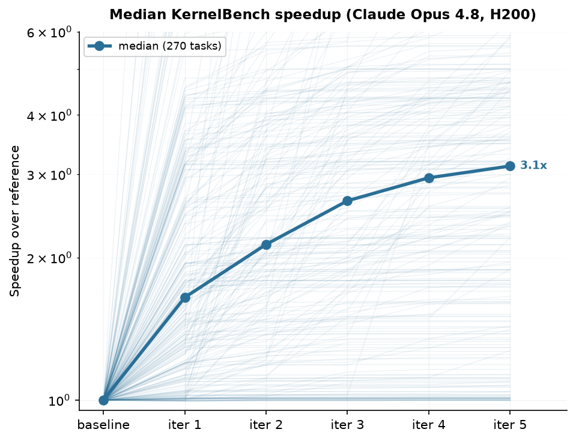

# KernelBench Results

This directory contains the compact aggregate for an AutoHelix run over all 270
KernelBench tasks.

## Headline

- Model: Claude Opus 4.8
- Hardware: NVIDIA H200
- Optimization budget: five iterations per task
- Final median best-so-far speedup: **3.12×**
- Attempts: 1,350 total; 1,347 accepted and three benchmark-gate rejections

Median best-so-far progression:

```text
baseline  iter 1  iter 2  iter 3  iter 4  iter 5
1.00×     1.65×   2.13×   2.64×   2.95×   3.12×
```



## Methodology

AutoHelix uses the upstream
[KernelBench](https://github.com/ScalingIntelligence/KernelBench) task
definitions and `Model`/`ModelNew` contract, but runs a stricter standalone
evaluator rather than the official KernelBench runner. It follows the fp32
correctness tolerance and fixed-input, cold-cache CUDA-event timing protocol,
while adding checks for evaluator tampering, output caching, timing
manipulation, and asymmetric precision settings.

## Files

- `results.json` — per-task iteration metrics, best-so-far values, cost, and
  wall-clock duration.
- `make_progression_plot.py` — regenerates the median progression figure.

To regenerate the plot:

```bash
python -m pip install matplotlib numpy
python results/kernelbench/make_progression_plot.py
```

Raw agent logs and task worktrees are not included because they are large and
are not needed to reproduce the aggregate figures from `results.json`.
